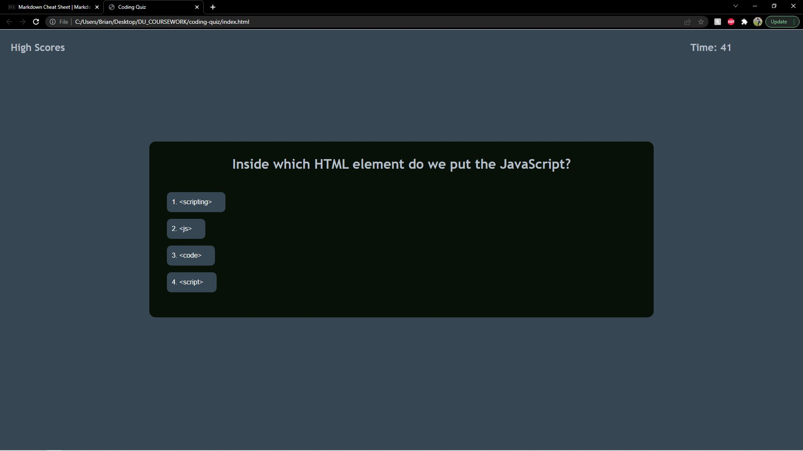

# Coding Quiz

Opening page prompts user to start the quiz with a \<button\> element. It also gives user an option to look at the past high scores from previous attempts.

Once start button is clicked, a timer appears in the upper-right corner of the window, while a question and multiple choice options are rendered in the center div containing the quiz. When an answer button is clicked, the next question is rendered in the same div. Below, the correctness of the previous answer is displayed along with the user's cumulative score. When the over, either after time runs out or after the questions are exhausted, the user is promped to submit their name to be added to the high score list. List has a max of 10 scores, if the submitted score is lower than the lowest on the existing list, the score will not appear on the list, otherwise, score will be added to the existing list. Once name is submitted, the high score list is rendered in the window. The user is then given the option to start over or to clear the current high score list.

